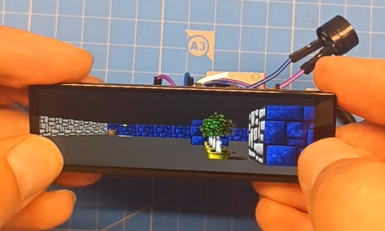

# Maze3D_ESP32S3_Long
3D maze rendered with ray casting on ESP32S3 microcontroller (with long display)

Video demos available on YouTube:

3D Maze on ESP32 Long Display (ray casting - like Wolfenstein 3D) https://youtube.com/shorts/84V7NFC1Kug
Can Wolfenstein 3D run DOOM? https://youtube.com/shorts/jfEZghWtNTY
Is there a party in Wolfenstein 3D? ... https://youtube.com/shorts/ehGf5XbMg5Q	
